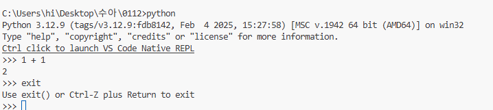
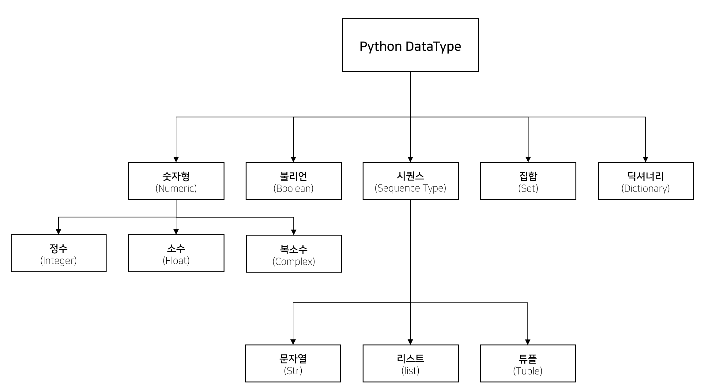

# Python 기초
파일 확장명

Python 파일 `.py`
- 웹 서비스용
- 코드만 저장하는 텍스트 파일
- 위에서 아래로 순서대로 한 번에 실행
- 프로그램, 서버, 자동화, 백엔드에 주로 사용

✅ 장점  
- 실제 서비스/프로그램과 동일한 방식  
- 파일 관리, 버전 관리(Git)에 최적  
- 코드 구조화 (함수, 클래스) 쉬움   

❌ 단점  
- 중간 결과 바로 확인하기 불편  
- 실험/분석용으론 답답할 수 있음  

Jupyter Notebook `.ipynb`
- 개발 환경(툴)에서만 실행(브라우저에서 쓰려면 Jupyter vsC에서 다운받으면 됨)
👉 코드 + 결과 + 설명을 한 화면에서 보는 노트북

특징
- 셀 단위 실행
- 실행 순서가 자유로움
- 코드 결과가 바로 아래에 출력됨
- 마크다운으로 설명 작성 가능

✅ 장점  
- 실험, 학습, 데이터 분석에 최고  
- 결과를 바로 시각적으로 확인  
- 설명 + 코드 + 결과 한 번에 정리 가능  

❌단점  
- 실행 순서 꼬이면 결과가 이상해질 수 있음  
- 대규모 프로젝트엔 부적합  
- Git에서 변경 내역 보기 불편  

파이썬 특징
- 모든 운영체제(원도우, 리눅스, 안드로이드, 맥OS 등)에서 돌아감
- 인터프리터 사용
https://github.com/ESG-EDU/Docs/raw/main/images/python/type.png

개발툴(설치링크)
- [Python](https://www.python.org/downloads/)
- [Anaconda](https://www.anaconda.com/):상업적 사용시 유료
- [Jupyter](https://jupyter.org/install)
- [VSCODE](https://jupyter.org/install)
- [PyCharm](https://jupyter.org/install)

활용
- [NumPy](https://github.com/ESG-EDU/Docs/blob/main/python/numpy.md): 수치 계산(numerical computation)”을 빠르고 효율적으로 수행하기 위한 라이브러리
 - `pip install numpy`로 설치
 - [Pandas](https://github.com/ESG-EDU/Docs/blob/main/python/pandas.md)
  - `pip install pandas`
 - BeautifulSoup:html 문서 수집, 웹 크롤링에 사용하는 종류 중 하나
  - `pip install beautifulsoup4`
 - Streamlit: 백엔드 이해 없이 페이지 생성 가능, 시각화를 위해 사용(AI프롬포트에 사용)
  - `pip install streamlit`
 - Selenium(자동, BeautifulSoup의 단점을 보완해줌)
  - `pip install selenium`
  - [**예제 데이터 다운로드 (정부3.0 공공데이터포털)**](https://www.data.go.kr/index.do)

  실행방법
  python (파일명).py
  Or
  상단의 재생버튼 클릭(파이썬 확장앱 깔면 가능)

  `pip list`로 깔려있는 거 확인 가능(pip가 npm같은 느낌)

```
  Package Version
------- -------
pip     25.3   
uv      0.9.16   //빠른 속도로 다운 가능하게 만들어진 것(vite같은 거)
```

pip는 해당 PC 어디서든지 사용 가능함(파일 위치 이동해도 명령어 실행 가능)
리액트에서 노드모듈즈를 프로젝트 단위로 쓰듯이 개인적 사용도 가능
[uv 설명 사이트](https://docs.astral.sh/uv/)

터미널 `python`라고 치면 브라우저 콘솔처럼 바로 쓸 수 있음(프린트같은 명령어 없이도 가능) => 인터프린터 언어라 가능!
대신 콘솔처럼 똑같이 저장은 안됨
exit() 탈출함수로 종료(jsx의 ctrl+C)


`venv`: 독립적인 개발 환경 만들기(가상으로 만드는 코드)
명령어: `python -m venv 폴더명`

venv 활성화(Activate) 명령어: `venv\Scripts\activate`
venv 비활성화(Deactivate): `deactivate`


- Jupyter Notebook 알아보기(서버공유,관리용)
Jupyter 설치
`pip install jupyter`
Jupyter 실행하기
`jupyter notebook`
종료 하려면 터미널에 Ctrl+C

뜬 브라우저에 New 누르면 새 파일 생성 가능
단축키 방향키아래 -> 코드[]생성
d두번 -> []삭제

=> 주피터는 구글코랩이랑 비슷함(파이썬 공유는 코랩 많이 씀)
깃허브에 올리면 주피터 화면이 프리뷰되어 그대로 뜸(코드 눌러보면 코드 확인 가능)

주피터 단축키
Ctrl + Enter    해당 셀 실행
Shift + Enter   실행 후 다음셀로
Alt + Enter
A / B           셀 추가
D D             셀 삭제
Y / M           코드 / 마크다운
Esc / Enter     모드 전환
x               잘라내기
c               복사
v               붙여넣기

🧠 주피터의 핵심 개념

주피터에는 파일이랑 **커널(메모리)**이 따로 존재함

1️⃣ 파일 (셀 내용)

화면에 보이는 코드
지우면 사라짐

2️⃣ 커널 (실행된 상태)

한 번 실행된 변수, 함수
메모리에 계속 살아 있음 ← 이게 함정
커널 초기화: 0 0 
변수만 지우기: del 변수


- md로 구분할 수 있음/ md기준으로 끊겨져서 접을 수 있음
- 출력할 때 파이썬은 print(a)라고 써야하지만 주피터는 그냥 a만 써도 출력됨
- 한 셀에 여러 코드를 작성하면 코드가 적용된 후에 가장 마지막 코드가 실행됨

-----


----

## 파이썬 자료형

str, list,tuple, set은 **빈 값**이면 `false`. **값이 있으면** `true` 

### 자료형 확인
type()
Bloone은 무조건 **대문자**로 써야함
주피터에서 문자열+숫자 사용할 때
+,-,/:계산 안되고 오류남
*:숫자만큼 반복됨

### 문자열
#### 표현법
- `''`/`""` 한줄로 줄줄 적을 때
```
''' / """
긴 문장으로
줄줄줄
적을 때
''' / """
```
\n으로 줄바꿈 구분도 가능함


### 파이썬에서의 길이를 구할 수 있는 자료 (= 시퀀스)
인덱스로 접근이 가능함  
👇그러나 수정이 가능한 친구들과 아닌 친구들이 나뉨

- mutable(변경 가능)
: 리스트(list), 바이트 배열(bytearray), deque 등

- immutable(변경 불가)
: 문자열(str), 튜플(tuple), range 등

#### 1️⃣ str (문자열)
```
text = "python"
print(len(text))  # 6
```
#### 2️⃣ list (리스트)
```python
nums = [10, 20, 30, 40]
print(len(nums))  # 4
```
- 값 변경 가능
- 추가 / 삭제 가능
- 정렬 가능
: `변수.sort()` > 숫자, 알파벳순, 가나다순
- 중복 값 몇개인지 찾기: `변수.count(값)`

#### 3️⃣ tuple (튜플)
```
point = (3, 5, 7)
print(len(point))  # 3
```
- list와 같으나 **값을 바꿀 수 없는** 리스트
- add, del, point[0]=1등 불가함


#### 4️⃣ dict (딕셔너리=js의 object)
```
user = {
    "name": "수아",
    "age": 20,
    "city": "Seoul"
}

print(len(user))  # 3   # key 개수
```
- **dict는 index가 없음 => key로만 찾을 수 있다**
- set ) dict라서 교,차,합 집합이 가능하나 **뒤의 값이 덮어씌워짐**

#### 5️⃣ set (집합)
```
colors = {"red", "blue", "green"}
print(len(colors))  # 3

nums = {1, 1, 2, 2, 3}
print(len(nums))  # 3 (중복 제거됨)

a = {1,2,3}
b = {3,4,5}

a & b   # {3}          >>교집합
a | b   # {1,2,3,4,5}  >>합집합
a - b   # {1, 2}       >>차집합
```
- **set도 순서가 없는 배열(No index)**
- 값 중복이 불가함 => 존재 여부 확인 가능
- 접근 자체가 불가함 => 존재확인, 순회만 가능
- 순회: for문 print로 하나씩 꺼낼 수는 있으나 순서는 랜덤임
=> pop()하면 set안의 어떤 값이 나올지 알 수 없음
- 🤔 그럼 언제 써요??
    ✔ 중복 제거  
    ✔ 빠른 포함 여부 검사  
    ✔ 교집합 / 합집합  

#### js와 다른 점
- 값 추가/삭제시 함수가 필요함
```
js
arr=[]  
arr[0] = 10
>> arr=[10]

arr=[] 
arr[0] = 10 
>>오류발생
```
- python은 값 추가의 개념이 아닌 **변경**이라서 기존 값이 없으면 바꿀 수 없음
- immutable은 당연히 못 바꿈

```
arr ="abcd"
arr[0] ="A"
print(arr)
```
- 문자열은 인덱스로 접근은 가능하나 직접 수정이 불가함
- 새 문자열 만들어 `arr = "A" + arr[1:]`이렇게는 가능

#### 추가 연산자
- 추가: `변수.append(값)` >> 값 하나만 가능
- 원하는 위치에 추가: `변수.insert(인덱스,값)`
- 리스트 병합: `변수.extend(리스트인 변수)`
- `+`: 변수 + [새리스트]

**set(집합)만 가능한 연산자**
- `변수.update(리스트)` >> 여러값 추가

#### 삭제 연산자
- 인덱스로 삭제:
    -`del 변수[i]` >> 슬라이스로 여러 값 삭제 가능
    -`변수.pop(i)`  >> 하나만 가능, i없으면 마지막 값 삭제
- 값으로 제거: `변수.remove(값)` >> 값이 없으면 오류발생
- 전체 요소 삭제: `변수.clear()`
----

## 논리연산자 우선순위
### not >비교연산자> and > or
not 1 == 1 and 1 != or 1!= 1
이건
1️⃣ 비교부터
```
1 == 1   → True
1 != 1   → False
1 != 1   → False
```
👉 not True and False or False

2️⃣ not
```
not True → False

```
👉False and False or False

3️⃣ and
```
False and False → False

```
👉 False or False

4️⃣ or
👉 False

----

## 변수
a = 1
js처럼 var, let, const가 없음
값이 무조건 덮어씌워짐

**문자열과 변수 같이 출력하는 방법**
1. `print(i,"*", j, "=", i*j)`    js의 +같은 기능이 ,
2. `print(f"{i} * {j} = {i*j}")`  js의 `백틱${}백틱`같은 기능이`f"{}"`
----
## 함수
생성 def fn()
요청 fn()

함수사용
함수 사용시 끝에 ;가 아니라 **:로 할당**해줘야함
실행부에 `tap`눌러줘야만 실행 가능함`{}`와 같은 의미
들여쓰기 없이 한줄로 작성해도 가능함(여러줄은 무조건 들여쓰기!)
```
def add(a,b):
    return a+b

add(3,4)
```

```
a = 10
if a < 10: print("10보다 작다")
elif a > 10: print("10보다 크다")
else : print("알수없다")
```

class
함수를 묶어놓는 구조(값(상태) + 함수(행동)를 묶어서 재사용할 때)

``` js
class선언
class Calculator {
  constructor() {
    this.total = 0
  }

  add(num) {
    this.total += num
    return this.total
  }
}

생성
const calc = new Calculator()
calc.add(5)   // 5
calc.add(3)   // 8

python
선언
class Calculator:
    def __init__(self):
        self.total=0
    def add(self,num):
        self.total +=num
        return self.total

생성
c = Calculator()
print(c.add(2)) #2
print(c.add(3)) #5
```

### JS
constructor (생성자)
객체가 생성될 때 자동으로 실행되는 함수(초기값 넣을 때 많이 씀)
new 키워드 → 클래스 설계도로 실제 객체 생성
즉
Aclass → 설계도
ac → 실물 객체
constructor()가 이때 실행됨

### Python
`__init__(self)` = js의`constructor() {}`
객체가 만들어질 때 자동으로 실행되는 초기화 함수
-> d = Calculator하면 다시 0으로 초기화 됨
`self`: 지금 만들어진 그 객체 자신(여기서는 c), 관례라서 다 self라고 씀(js의 this랑 비슷함)
`pass`: 아무것도 실행하지 않고 넘어가겠다.는 의미 => 왜 써요?? 코드가 들어갈 자리인데 아직 정하지 못 했을 때 사용.
```
x = 5
if x<10:
    pass
print ('바보')

>>> '바보'
```


### __함수__
: Python 내부 규칙용 함수 / 매직 메서드 (magic method) 또는 던더 메서드 (dunder method)라고 부름 / 자동호출용이구나 알 수 있음
- 직접 잘 안 부름 ❌
- 특정 상황에서 Python이 자동 호출 ⭕
- 일반 함수랑 이름 충돌 방지를 위해 ()가 아닌 __함수__ 형태로 씀 
- 종류
| 함수            | 언제 자동 실행  |
| ------------- | --------- |
| `__init__`    | 객체 생성 초기화    |
| `__str__`     | print 호출시 문자열 반환    |
| `__repr__`    | 객체 그대로 출력 |
| `__add__`     | + 연산      |
| `__len__`     | len()     |
| `__getitem__` | [] 접근     |

- `__init__`
- 객체를 생성하면 자동으로 호출 됨
```
class Person:
    def __init__(self, name, age):
        self.name = name
        self.age = age

p = Person("Alice", 25)
print(p.name, p.age)  # Alice 25

```
- `__str__` 
```
class Person:
    def __init__(self, name):
        self.name = name
    def __str__(self):
        return f"Person 이름: {self.name}"

p = Person("Bob")
print(p)  # Person 이름: Bob
```


-----

## 제어문

### if문(조건문)
if elif else로 나뉨
`()` `{}`없이 사용 가능

```
if 5>a : print("5가 크다")  #여러줄이면 아래 한줄씩 들여쓰기 작성
elif 5<a :
    print("a는")
    print("5보다 크다")
else : print("a=5")
```

### for문(반복문)
for 변수 in 리스트(or튜블,문자열)

파이썬은 in 자체가 of 역할을 하기 때문에 오로지 for in문만 존재함
js처럼 `for(i=0; i<10; i++>)` 하는 방법은요?
for 변수 in range(시작 값, 끝 값, 증감식):
-range란? 정수 시퀀스를 생성하는 내장함수
```
for i in range(2,10,2):
    print (i)  # 2,4,6,8
```

**시작값은 >=**, **끝 값은<**임, 시작은 포함하고 끝은 포함하지 않는다.
```
for i in range(10)
    print (i)  # 0~9
```

값 하나만 넣으면 시작은 무조건 0이 되고 끝 값 지정하는 식이 됨