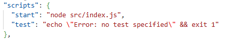
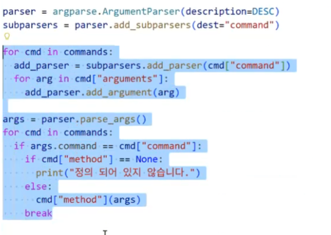

npm i로 다운받아야 할 것

express -> nodejs로 서버 만드는 라이브러리
(maria DB)
cors 백-프론트 연결시켜주는 라이브러리
dotenv 만든 환경변수를 가져오는데 필요한 라이브러리
http: http서버를 만들 수 있음(여기 웹소켓 합침)
socket.io: 소켓 라이브러리

1. 백엔드: 데이터베이스 세팅(유저정보, 채팅 정보 등..)
-Schema(스키마): 데이터의 설계도 같은 느낌
어떤 형태/규칙으로 데이터를 받을 것인지 설명해놓은 파일

