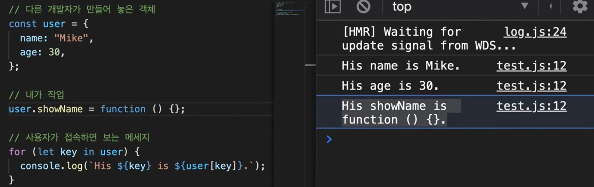
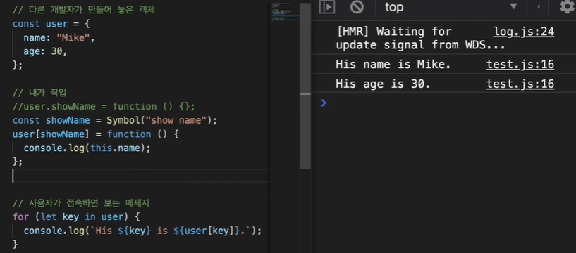

# ✅ Javascript (ECMAScript)

**동적인 웹 페이지 구현을 위함**
- 객체 지향 프로그래밍 OOP
- `JS` 혹은 `ES`라고 부름
- 주로 frontend에 사용하는 프로그램 (백엔드엔 한계가 있음)

script의 src 확인하는 방법  
콘솔 → Sources → js 파일

script도 body처럼 스크립트 순서대로 출력됨


```
<script>어쩌구</script> 
<script>저쩌구</script>

=> 어쩌구저쩌구
```


---

## ⭐ 자료형

- 값이 가지고 있는 타입을 말함
- `typeof 값`으로 값의 자료형을 알아볼 수 있음

### 🟡 기본 타입 (Primitive Type)

- number  
  안전한 정수 범위  
  `-(2^53 - 1) ~ (2^53 - 1)`
- bigint  
  위 범위를 초과하는 정수 표현 가능
- string  
  문자열
- boolean  
  논리값 (`true`, `false`)
- undefined  
  초기화되지 않은 상태  
  함수에서 출력값이 없을 때  
  변수 초기화에 사용  
  (JavaScript에서만 사용됨)
- null  
  객체 변수 초기화 시 사용
- NaN  
  Not a Number  
  숫자로 변환할 수 없는 연산 결과

**number, 특수기호 ⊂ string**  
그래서 숫자가 포함된 문자열은 문자열로 봄  
```
5 + 1 = 6
5 + "1" = 51 //('5'와'1'을 다 문자로 봐서 계산이 안됨)  
```
#### ✅ 문자열
"" / ''/ 백틱
```
let name = "수아"
let age = 27
1️⃣ var message = '저는 ' + name + '이고, 나이는 ' + age + '세 입니다.';   //''=""
2️⃣ var messageTwo = `저는 ${name}이고, 나이는 ${age}세 입니다.`;
```
1 ,2 모두 같은 문자열로 출력됨

#### 🔄 형변환 함수
- `String();:` ()안의 내용을 전부 문자열로 치환해줌  
                숫자/논리값/null/undefined 가능  
- `Number();:` ()안의 내용을 숫자 타입으로 변환해줌
                숫자를 쓴 문자열/논리값 가능  
                "안녕"등은 NaN라서 오류날 수 있음  
                null = 0, undefined = NaN
- `Boolean();:` ()안의 내용을 true/false로 구분해줌  
                0, "", null, undefined, NaN => false  
                "0", " ", 나머지 값들 => true  

---

### 🟢 참조 타입 (Reference Type)

- array
- function
- ...

---

## 📦 변수

## 💡 변수의 생성 과정
1. 선언 단계: 변수를 만드는 것
2. 초기화 단계: 변수에 처음으로 값을 할당하는 것
3. 할당 단계: 실제로 값이 들어감(🤔초기화랑 뭐가 달라요? = 할당은 재할당이라는 것이 가능하지만 초기화는 가장 최초의 값을 갖는 순간임)
```  
var age;        // 선언  
var age = 20;   // 선언 + 할당
```

* var : 선언+초기화 -> 할당
* let : 선언 -> 초기화 -> 할당
* const : 선언+초기화+할당
```
const age; 
age = 20;    ///이렇게 불가능. 오류 발생
const age =20; //이렇게만 사용 가능. 할당까지 이뤄져야해서
```

### 🧩 변수 선언
* 호이스팅  
: 스코프 내부 어디서든 변수 선언은 최상위에 선언된 것 처럼 행동
(**but** 할당은 호이스팅 되지 않아 값이 들어가진 않고 undefined가 됨 // 오류가 나지 않을 뿐)
* Temporal Dead Zone(=TDZ)
: 일시적 사각지대  
let/const로 선언한 변수가 선언은 되었지만 초기화 전까지 접근할 수 없는 구간
* var → 선언 + 초기화(undefined)까지 같이 올라감
* let, const → 선언만 올라가고 초기화는 안 됨(그래서 오류 발생)

```
console.log(a); // ❌ ReferenceError
let a = 10;

// 호이스팅 단계
// a는 존재하지만 아직 초기화 안 됨 (TDZ)

console.log(a); // ❌ 접근 불가
a = 10;         // 여기서 TDZ 종료

//var 비교

console.log(x); // undefined
var x = 10;
console.log(y); // ❌ ReferenceError (TDZ)
let y = 10;
```


#### var
- 함수 스코프: 함수내부를 제외하고 다른 블록에서 선언하면 블록 밖에서 사용 가능함
- 한번 선언된 변수를 다시 선언할 수 있음
- 값 변경 가능
- 선언 전에 사용해도 호이스팅됨

#### let / const
- 블록 스코프: 함수, if문, for문, while문..등 블록 내부에서 선언한 변수는 블록 밖 범위에서 사용할 수 없음
- ES6 이후 권장

#### let 변수 = 값
같은 변수를 여러번 선언할 수 없음  
값은 변할 수 있음
```
let name = "Mike"
let name = "Jake"    // 오류 발생(이미 name은 선언 된 변수라서)
name = "Jake"
console.log(name)   /// Jake
```
이렇게 값을 변경할 수 있기 때문에 여려 개발자가 작업하는 경우 최종값이 변경 될 위험이 있음  

#### const 변수 = 값
const는 절대 변하지 않는 상수를 설정할 때 사용함  
한번 정해진 값은 바꿀 수 없음
---

## ⚖️ 비교 연산자

- `<`, `>`, `<=`, `>=`, `==`, `!=`
- `==` 값 비교
- `===` 값 + 타입 비교
```
ex) 5=="5": true
    5==="5": false
```
-이걸 어디에 사용하나요?? 👇

## 🔀 조건문

### 〰️ if

`if(){}`형태로 사용
- ()안의 내용이 true일 경우 {}를 실행한다. 라는 의미
```
if(age>19){
  console.log("성인")
}
```
- =age>19가 true일 경우 "성인"/ false일 경우 아무일도 일어나지 않음

#### 사용예시

```
let age = 19

if(age > 19){
  console.log("성인")
} else if(age == 19){
  console.log("수험생")
} else{
  console.log("미성년자")
}
```

- if가 false이면 -> else if의 조건이 true인가? -> else if도 false면 -> else실행
- 왜 else는 ()가 없나요?  
  : else는 if의 조건이 false일 때 실행하는 내용이기 때문에 조건이 필요가 없어서 ()가 없음

### ♾️ switch
```
let result = prompt('숫자를 입력하세요.');

switch(result){
  case "1" : 
    console.log("하나")
    break;
  case "2" : 
    console.log("둘")
   break;
  case "3" : 
    console.log("셋")
    break;
  case "4" : 
    console.log("넷")
   break;
  case "5" : 
    console.log("다섯")
    break;
  default:            // case에 없는 값을 넣는 모든 경우
    console.log('1~5만 입력하세요')
}
```
왜 매 줄마다 break가 있나요?   
swith는 case를 위에서 부터 읽어내려옴.   
case에 해당하는 값이 들어오면 break를 만나기 전까지 해당 case부터 끝까지 모든 값을 출력함(default도)  
그래서 보통 원하는 값 이후의 목록이 필요한 경우에 break없이 사용함  

----

## 🔗 논리 연산자

1. || : OR
- 여러개 중 하나라도 true이면 => true
- 모든 값이 false여야만 => false
- 여러 조건 중 하나라도 true를 만나면 멈춤, 뒤의 조건은 읽어들이지 않음
```
let name = "수아";
let age = 20;
let gender = false;

if(age === 10 || name === "수아" || gender === false){ ~~~ }
```
- 이 경우 name이 true이기 때문에 뒤의 gender는 확인하지 않고 {}를 실행함

2. &&: AND
- 모든 조건이 true여야만 true
- 하나라도 false면 false

3. !: NOT
- true <-> false  
!true === false  
!false === true
```
const isAdult = age> 19;
let age = 10

if(!isAdult){
  console.log('애기');    // 애기
}
```

!isAdult = age<= 19 // 라는 뜻이 되기때문에  age = 10은 애기가 됨

* **평가 순서는 많이 제외되는 순서로 작성해주는 것이 좋다!**
- 코드를 읽는 양이 줄어들어 실행시 더 빨라질 수 있음
- 예) `운전면허가 있고 시력이 좋은 여군`의 값을 구해야 한다.  
전체 군인 비율로 운전면허: 70%, 좋은 시력: 50%, 여군: 7% 이라면 
`여군이고 시력이 좋고 운전면허가 있는 군인`으로 설정해줄 때 읽어들이는 정보의 폭이 줄어들어 수월해진다. 

### 우선순위
- ! > && > ||
```
if (a === 1 || b === 2 && c === 3) 이건
if (a === 1 || (b === 2 && c === 3))와 같음
```
=> 그래서! 1이거나 2이고, 그리고 3일 때 라고 하고싶다면  
`if ((a === 1 || b === 2) && c === 3)` 처럼 ()로 묶어줘야함
- ex) 수아는 여자 && 한국인 && 10살  => false

----

## 🔁 반복문

### for
형태
```
for(초기값; 조건; 증감식){
  반복할 코드
}
```
조건이 false가 될 때 까지 {}안의 코드를 반복하는 함수  

Ex) 
```
for(let i = 0; i<10; i++){}
```

### while
```
let i = 0  // 할당

while(조건){
 실행할 코드
  변수를 변경할 코드
}
```
Ex) 
```
let i = 0

while(i<10){
  console.log(i)    // 0~9 출력
  i++               //이게 없으면 계속 i === 0이기때문에 무한반복됨
}
```
실행코드와 증감식의 순서가 바뀌면 어떻게 되나요?  
증감식이 먼저 오는 경우 i를 증감을 먼저하고 뒤 실행코드를 실행함  
위 예시에서 순서를 바꾸는 경우  i=1부터 시작됨  
즉 console에 1~10까지 찍힘(i=0 -> i+1(=1) -> 1출력, i=1 -> i+1(=2) -> 2출력 ... i=9 -> i+1(=10) -> 10출력)

### do.. while
무조건 한번은 실행한 후 조건을 판별함
```
let i = 0;
do{
  console.log(i);
  i++;
}while(i<10)  // 이 경우 while의 조건이 false가 되기 전, 9까지 로그에 찍힘

let i = 10;
do{
  console.log(i);
  i++;
}while(i<10)   // 이 경우엔 조건이 false지만 i =10이 한번은 찍힘!!
```


---

## ⛔ 반복문 제어

### break
break를 만나는 순간 반복문을 탈출하고 나옴
무한반복문에 주로 사용함

### continue
코드 실행을 멈추고 다음 반복 진행

```
for (let i = 1; i <= 10; i++) {
  if (i === 5) {
    break;
  }
  console.log(i);   // 1~4까지만 출력됨 / 5를 만나면 반복문 자체를 종료함
}

for (let i = 1; i <= 10; i++) {
  if (i === 5) {
    continue;
  }
  console.log(i);   // 1~4 + 6~10 출력함 / 5를 만나는 순간만 건너뛰고 반복문이 계속됨
}
```

---

## 🧠 함수

함수를 사용하는 이유    
코드를 여러번 재사용 할 때 편하기 위함  
실행이 필요할 때마다 일일히 코드를 넣지 않고 그 이름의 함수만 호출하면 실행되기 때문에 재사용이 가능함.
```
  전역변수
let ex = 1

 함수     함수명  매개변수
function sayHello(name){
  
    지역변수  
  let ex2 = 2

  console.log(`Hello ${name}`);   -> 실행코드
}
    함수호출
sayHello("Mike"); -> 매개변수에 Mike를 넣어주고 sayHello를 실행함

-----------------------------------------------

  let ex = 1

  선언&&할당   
const Hello = function sayHello(name){
  let ex2 = 2
  console.log(`Hello ${name}`);
}

Hello("Mike"); 
```

- function => 함수 선언식(sayHello라는 이름의 함수는 {}을 실행하는 함수라고 선언해줌)  
  호이스팅 됨
- const => 함수 표현식(이 이름의 함수를 Hello라는 이름의 변수로 정의하겠다.)
- 전역변수: 함수 밖에 선언한 변수.   
          - 선언식은 호이스팅 되어서 어느 위치(함수 밖의)에 작성하든 전역변수가 사용 가능함
          - 표현식은 변수는 호이스팅 되지만 함수는 할당 전까지 사용 불가
- 지역변수: 함수 내에서만 사용가능한 변수, 함수 밖에서는 존재하지 않음
- 매개변수: 함수를 선언할 때 ()안의 값을 함수를 호출할 때 ()에 넣은 값으로 대체시켜줌
          default값을 정해줄 수도 있음 `sayHello(name = "friend")`라고 하면 sayHello();할 경우 freind가 나옴

*return 값을 반환하는 선언문
```
function add(num1, num2){
  return num1 + num2;     // return문 값을 반환하고 종료함
  num1 * num2             // 얘는 절대 실행되지 않음
}
const result = add(2,3)   // 5가 됨
```

### ➡️에로우 함수
`function(){}`이 `() => {}`로 바뀌는 과정
```
hello = function(name){
  return `안녕하세요 ${name}입니다.`
}

let a = hello("수아");   // 안녕하세요 수아입니다.
===
hello = (name) => `안녕하세요 ${name}입니다.`
```

1) `function(){}`에서 function지움
2) `(){}` 사이에 `=>` 추가
3) `{}=>()`로 변경, return 삭제: return문은 ()로 바꿀 수 있음
4) `()` 삭제 -> 한줄이면 ()도 생략 가능함


#### ⚠️arrow 함수의 this
에로우함수는 일반 함수와 달리 자신만의 this를 가지지 않음  
전체 windows의 객체를 가리킴  
그래서 this.name을 해도 `() => {}`를 쓰면 widows엔 name이 없기 때문에 출력이 안됨


## 💯 문자열 함수
### 점'.' 연산자
변수.함수()  
`if (var a = "가나다라")`

#### 📏 길이
- length  
문자열의 전체 길이를 반환

#### 🔁 특정 문자 변경
- replace(기존, 변경)  
  해당 문자열 중 첫 번째만 변경
- replaceAll(기존, 변경)  
  해당 문자열 모두 변경

#### ✂️ 문자 추출
- substring(시작 인덱스, 끝 인덱스)
- slice(시작 인덱스, 끝 인덱스)

시작 인덱스부터 끝 인덱스 **이전까지** 추출  
끝 인덱스를 입력하지 않으면 문자열 끝까지 추출  
숫자 대신 다른 함수 값 사용 가능  
```
예)  
(0, a.length)  
a.length = 4 → (0, 4)
```

#### 🔍 문자 위치 찾기
- indexOf("문자")
해당 문자가 시작되는 첫 번째 인덱스 반환  
없을 경우 -1 반환  
여러 글자일 경우 첫 글자의 인덱스 반환  

예)  
a.indexOf("가나") = 0  
a.indexOf("나다라") = 1  

#### 🧩 문자 분리
- split("기준 문자"): 기준 문자는 결과 배열에 포함되지 않음  

```
a.split("나") → ['가', '다라']  
a.split("") → ['가', '나', '다', '라']
```

#### ➕ 문자 채우기
- padStart(전체 길이, 문자)  
  문자열 앞에 채움
- padEnd(전체 길이, 문자)  
  문자열 뒤에 채움  
```
a.padStart(7, '@') → @@@가나다라  
a.padEnd(7, '@') → 가나다라@@@
```

### 🔎 포함 여부 확인
- includes("문자")

문자가 포함되면 true  
없으면 false  
대소문자 구분

#### 🔂 반복
- repeat(횟수)

#### 🔠대소문자 변환
- toUpperCase() → 대문자
- toLowerCase() → 소문자

#### 🧹 공백 제거
- trim(): 양쪽 공백 제거
- trimStart(): 왼쪽 공백 제거
- trimEnd(): 오른쪽 공백 제거
-replaceAll(" ", ""): 문자열 전체의 모든 공백 제거  

#### 💡 인덱스 개념
예시 문자열: "GOOD~"
```
G 앞이 0  
G O 사이는 1  
O O 사이는 2  
O D 사이는 3  
D ~ 사이는 4  
~ 뒤는 5  

(1, 4) → OOD  
-4 → O  
```
인덱스의 최대값 = length - 1

## Object = 객체
`{}`으로 묶은 값을 객체라고 함
`let name = {};`이라고 하면 하나의 빈 객체를 만들겠다는 의미이고 함수를 통해 안을 채울 수 있음

```
const man = {
  name: "Super", 
  age:33,
}
```
👆 이런 식으로 씀  
- 객체 안의 `key : 값` 의 형태를 **property**라고 함
- 프로퍼티 끼리는 ,로 구분함

### 접근 / 추가 / 삭제
1️⃣접근
- **변수명.key / 변수명["key"]** 형태
- `man.name` / `man["name"]`

2️⃣추가
- 접근의 형태 = "새로운 값"
- `man.gender = "male"`
- `man["color"] = "white"`

3️⃣ 삭제
- property 앞에 **delete**
- `delete man.color`

### 단축 property
```
//먼저 선언된 경우
const name = "Super";
const age = 33

const man = {
  name: name, 
  age: age,
  gender: true,
}

|| 

// 인자값으로 받을 경우
funtion Man(name, age){

}

const man = {
  name: name, 
  age: age,
  gender: true,
}

Man("Mike", 30)

👇이렇게 변경 가능

const man = {
  name, 
  age,
  gender: true,
}
```
❓ 프로퍼티 존재 여부 확인
- 존재하지 않는 프로퍼티에 접근할 경우 `undefined`
- in 연산자 사용
  - "프로퍼티 명" in 객체
  - 'age' in man; 
  - `console.log('age' in man;)`로 확인 // true or false 값 나옴

🤔 언제 쓰나요??  
조건식을 구분할 때 객체가 없는 경우 undefined가 되어 원하는 값이 출력이 안 될 수 있음  
이럴 때 존재 여부를 파악하는 조건이 필요해서 사용함
```
function isAdult(user){
  if(user.age<20){
    return false;
  }
  return true;
}

const Mike = {
  name: "Mike",
  age: 30,
}

const Jane = {
  name: "Jane",
}
```
이 경우 Mike는 20이상이라 true를 반환하지만
Jane은 값이 없어 undefined == false라서 if조건이 참이 아니라 true를 반환함
그럴 때!! ` if(!("age" in user) || user.age<20)`을 추가해줘야함

### 객체 프로퍼티 형식(문자열 & Symbol)
#### 1. 문자형: 문자로 만든 property key
- key 이름이 문자형인 경우를 이름
- 우리가 자주 사용하는 {name: "1"} 이런 형태
- 반환 시 "name" 이렇게 문자형으로 반환해줌
- 접근할 때도 문자형으로 접근 가능: obj["name"]  // -> "1"

#### 2. Symbol: 자료형의 일종 / 유일한 식별자를 만들 때 사용(id와 같은 느낌)
- `const a = Symbol(설명 혹은 이름);` 형태
- 객체에 “절대 겹치지 않는 숨겨진 key”를 만들기위해 사용
```
const a = Symbol("id")
const b = Symbol("id")

a === b; => false
a == b; => false

설명이 똑같아도 유일하기 때문에 다른 값으로 인식함
```
- method로 접근 할 수 없음(숨겨지는 느낌)
- 언제 쓰면 좋을까?
1️⃣ 라이브러리 / 공용 객체 확장할 때  
다른 사람이 만들어둔 객체에 key를 추가하고 싶으나 해당 key가 있는지 없는지 모를 경우 덮어씌우지 않기 위해 사용함  
:DOM 요소, 전역 객체, 다른 사람 코드 👉 절대 충돌 안 남  
2️⃣ 내부용 데이터 숨길 때  
완전한 private은 아니지만 실수로 접근하는 걸 방지  
3️⃣ “진짜로 유일해야 하는 key”  일 때

*Symbol 없을 때*


이처럼 보이고 싶지 않은 내용을 사용자가 보게 됨  

*Symbol 있을 때*



- 전역변수처럼 쓰고싶다면?(심볼을 이름처럼 사용할 때)
`Symbol.for(설명)`  
같은 `Symbol.for(설명)`을 쓰는 변수는 같은 값으로 인식함(a==b / a===b)
설명(이름)을 알고싶다면 `Symbol.keyFor(a)`  --> "설명"
- 🤔 왜 id말고 Symbol을 쓰나요??? 
```
const user = { id: 1, name: "mike" };
const extra = { id: 999, age: 20 };

const merged = Object.assign({}, user, extra);

이렇게 두 객체를 병합하는 경우

{
  id: 999,   // ❗이처럼 기존 id가 덮어씌워짐
  name: "mike",
  age: 20
}
```


### method
- 객체의 프로퍼티 중 함수를 이르는 말
```
const Mike = {
  name: "Mike",
  age: 30,
  fly: function(){    // 얘가 method
    실행 코드
  }
}
```
- `: function`은 생략 가능함

### 생성자 함수
* 객체를 여러개 만들어야할 때 사용
- new연산차로 함수 호출하여 함수에 값을 넣어주는 역할
* 형식: **첫 글자는 대문자**

```
function User(name,age){
  this.name = name;
  this.age = age;
}

let user1 = newUser('A',10);
let user2 = newUser('B',20);
let user3 = newUser('C',30);
```
- 작동 과정
```
function User(name,age){
    *this = {}  -------> this에 빈 객체 만들어 할당함
  this.name = name;
  this.age = age;    --> User실행하며 this의 프로퍼티 할당함
    *return this; -----> this 반환함
}
```

- 사용 예시
```
function Item(name, price) {
        this.name;
    this.price;
    this.showPrice = function () {
        console.log(`가격은 ${price}임.`);        
    }
    
}

const item2 = new Item('인형', 80000)

console.log(item2.showPrice()) //가격은 80000임.
```
---

### Computed property = 계산된 프로퍼티
```
let a = 'age'

const user = {
  name: 'mike',
  age: 30,      //age->[a]
}
```
- 여기서 user의 age를 `[a]`로 바꿔주면 변수 a에 할당된 값이 들어감
- 식 자체에 넣는 것도 가능함
```
const user = {
  [1+4]: 20,
  ['안'+'녕"]: "안녕하세요",
}

// user -->{5: 20, 안녕: "안녕하세요"}
```
---

### Object.Method
객체에서 사용할 수 있는 메소드
1. 객체 복제
- const 새변수 = Object.assign({초기값},기존변수=매개변수)  
```
const newUser = Objetct.assign({},user)
=> newUser = {내가 채울 값} + {기존 객체 값}

// newUser != user
```
- **같은 이름의 key value를 바꿔도 기존 객체는 바뀌지 않음**

- ⚠️**주의할 규칙**: 뒤에 오는 객체가 앞의 갚을 덮어씀👇

```
const user = {
    name: "tom"
}

const newUser = Object.assign({name: "mike"},user);

console.log(newUser.name)  //"tom"

-->❓WHY? 뒤에 온 user가 앞의 {name: "mike"}를 덮어 썼기 때문. 꼭 함수 선언 후 값을 따로 할당해줄 것.

```
- 기존에 있는 key의 값을 바꾸기 위해서는?
- 두개 이상의 객체도 합칠 수 있음
```
const user = {
    name: "tom"
}
const age = {
    age: 30
}
const gender = {
    gender: 2
}

Object.assign(user, age, gender);

--> {name: 'tom', age: 30, gender: 2}
```

`const clone변수=기존변수`랑 뭐가 다르죠??  
clone은 객체를 복사해 새로 만드는 것이 아니라 위치값을 공유하는 형태. clone변수 내의 객체값을 바꾸면 기존 변수 객체의 값도 변경되어버림

2. 키 배열 반환
Object.keys(객체명);
- 객체에 들어있는 key를 전부 배열로 반환해줌
- ex) [name, age, gender]

3. 값 배열 반환
Object.values(객체명);
- 객체에 든 값을 배열로 반환해줌
- ex) ["tom", 30, 2]

4. 키/값 배열 반환
Object.entries(객체명);
- 객체의 키와 값을 하나씩 묶어서 배열들로 반환해줌
- ex) ["name","tom"], ["age",30], ["gender", 2]

5. 키/값 배열 -> 객체 반환
- Object.fromEntries(배열명);
```
const arr = [
  ["name","tom"], 
  ["age",30], 
  ["gender", 2]
]

Object.fromEntries(arr);

---> {
  name: "tom"
  age: 30
  gender: 2
}
```
- **arr이 바뀌는 게 아님!!** 단지 값을 반환해 줄 뿐.

---

## Array = 배열
순서가 있는 리스트 -> 인덱스를 가짐
let arr = ["a", "b", ... "j"]

```
let arr = ["a", "b", ... "j"]

console.log(arr[0])  // "a"

⚠️ 수정 가능함
arr[0] = "i";
console.log(arr)  // ["i", "b" ...]
```
### 배열 함수
- 길이: arr.length
- 끝에 추가: arr.push(값)
- 끝 요소 삭제: arr.pop()   --> ()는 함수호출. 값을 넣는게 아님
- 제일 앞에 추가: arr.unshift.(값)
- 제일 앞 삭제: arr.shift

---

## 숫자, 수학 Method

### toString();
숫자를 문자열로 바꿔주는 메소드  
1()안에 숫자를 쓰면 해당 진수 숫자를 문자열로 바꿔줌
```
const num = 10

num.toString();  //'10'
num.toString(2); //'1010'

const num2 =225;

num2.toString(16); //'e1'
```
### Math.메소드
- `Math.PI`: 원주율 값 알려줌
- `Math.ceil(변수)`: 올림
- `Math.floor(변수)`: 내림
- `Math.round(변수)`: 반올림
- `변수.toFixed(자릿수)`: 변수의 숫자를 원하는 자릿수에서 반올림 해줌
  **⚠️문자열로 반환하기 때문에 `Number();`로 숫자형으로 바꿔줘야함**
  -ex) 
    ```
    let a = 30.1234;

    a.toFixed(2); ---> 30.12
    a.toFixed(0); ---> 30
    a.toFixed(7); ---> 30.1234000
    ```

- `isNaN(변수)`: 변수의 값이 숫자형인지 판별해줌(숫자가 아니면 true, 숫자면 false)
  - ⚠️ **NaN도 숫자가 아니라고 판단함** 오로지 숫자열만 false
```
let x = 30
let y = "a"
let z = Number("b")
let a = Number("30")

isNaN(x)  // false
isNaN(y)  // true
isNaN(z)  // true
isNaN(a)  // false
```
-`parseInt()`: 문자열을 숫자로 바꿔줌
  - Number과 다른 점: 문자열을 만나기 전의 숫자만 바꿀 수 있음(넘버는 문자열을 넣으면 NaN이 됨)
  - 2진수, 16진수로 변환 가능함  
```
let margin = "10px12"

parseInt(margin);   // 10
parseInt(margin, 2);   // 2
```
- `Math.max(인수)`: 인수들 중 최대값 찾기
- `Math.min(인수)`: 인수들 중 최솟값 찾기
- `Math.min(숫자)`: 절대값 구하기
- `Math.pow(n,m)`: n의 m제곱 구하기
- `Math.sqrt(숫자)`: 제곱근 구하기
- `Mate.random()`: 0~1사이 무작위 숫자 생성
    `Math.floor(Math.random()*(max-min+1))+min` 해서 범위 지정도 가능함  
    ex) Math.floor(Math.random() * 100) + 1 : 1~100

## this

